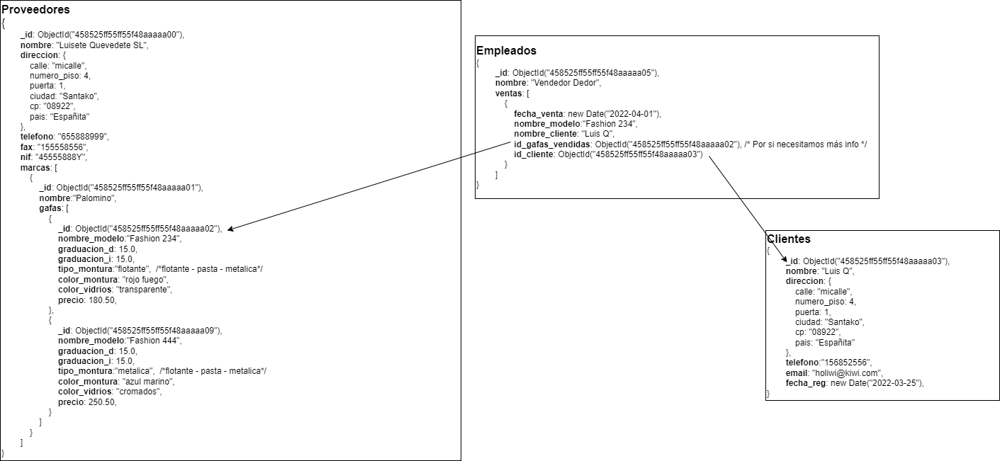
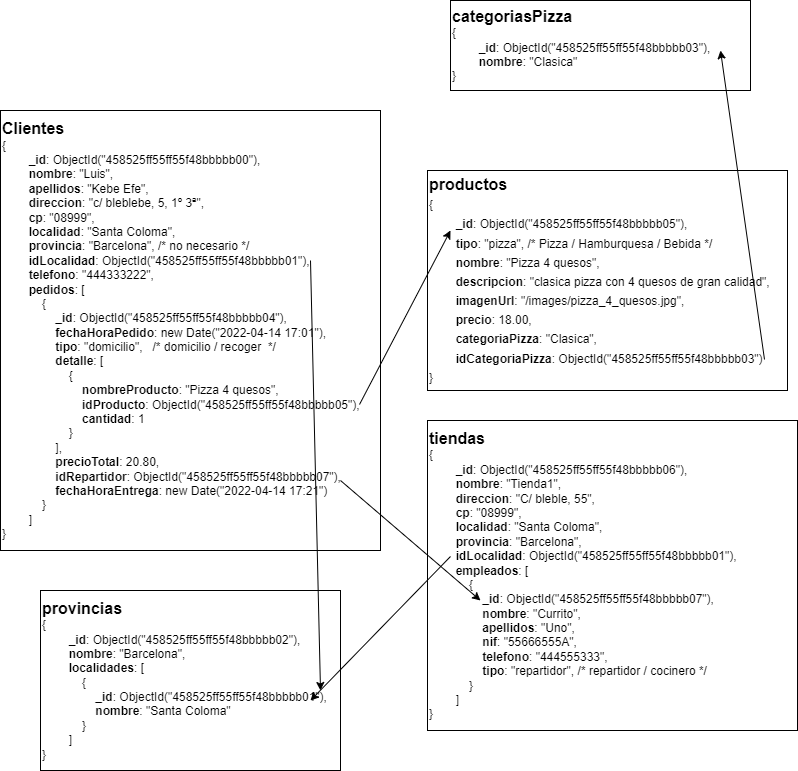

# Entrega 2.3: Estructura de dades MongoDB
Los scripts **.js** los puedes encontrar en la carpeta raiz. Los diagramas los puedes encontrar en la carpeta **diagramas**
## Nivel 1
### Ejercicio 1 - Óptica
#### Script
fichero con script de generación de BD **optica.js**
Para ejecutarlo:
```
npm run optica
```
#### Diagrama

### Ejercicio 2 - Pizzeria
#### Script
fichero con script de generación de BD **pizzeria.js**
Para ejecutarlo:
```
npm run pizzeria
```
#### Diagrama
